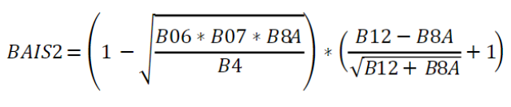

# Automatic Burnt Area Mapper

Burnt area detection using the delta NBR method. The **delta NBR method is a simple, yet effective, method to identify burnt areas**. This repo employs an **ensemble of 3 different burnt area indices** for best results.

## How to run the algorithm

To run the algorithm for the Alpha Road Tambaroora Wildfire in Australia, all you need to do **run the Docker container by following the description** below: [How to run the Burnt Area Mapper using Docker](#how-to-run-the-burnt-area-mapper-using-docker)

If you wish to **apply the algorithm for a different site** (and different time window, presumably), please have a look at the parameter description: [Parameters](#parameters)

## Algorithm
The **delta NBR method is a simple, yet effective, method to identify burnt areas** based in evaluation the spectral differences between a prefire and a postfire multi-spectral image. 

This repo employs an **ensemble of 3 different burnt area indices** in order to reduce unwanted artifacts. The rationale here is that with an unsupervised method such as the thresholding of delta NBR, you run the risk of classifying areas as burnt that only share the same spectral characteristics, but are not actually burnt. One way **to reduce these artifacts is to consider several equally good algorithms that complement each other well regarding their strengths and weaknesses** (i.e. which landscape features are misclassified).

The base method, delta NBR using the classical NBR index, is implemented as described [here](https://un-spider.org/advisory-support/recommended-practices/recommended-practice-burn-severity/in-detail/normalized-burn-ratio)

Using Sentinel-2 image bands, this means we use the following formula for NBR:


(García & Caselles, 1991)

The other 2 formulas used in the ensemble are:
#  `MIRBI = 10 * B12 - 9.8 * B11 + 2`
(Trigg & Flasse, 2001)



Filipponi (2018)

## Parameters

All parameters need are defined in a YAML file named `config.yaml` which you will find at the top level of the repo. Here is a description of the main parameters:
* `prefire_product`: Sentinel-2 **scene BEFORE the fire event**; see next section for details on the supported "formats"
* `postfire_product`: Sentinel-2 **scene AFTER the fire event**; see next section for details on the supported "formats"
* `aoi`:
  * `ll`: **lower-left corner** of bounding box (i.e. South-West; format: Northing and Easting value in decimal degrees as a list, e.g. [48,11.5] for Strasslach near Munich)
  * `ur`: **upper-right corner** of bounding box (i.e. North-East)

### Input options for Sentinel-2 products
  * **date** (default): string in ISO-format (`YYYY-MM-dd` format, e.g. `2023-03-05`)
  * **archive/folder**: zipped or unpacked Sentinel-2 L2A product, as disseminated by esa (e.g. file name `S2A_MSIL2A_20230305T000221_N0509_R030_T55HGD_20230305T024055.SAFE.zip`)

### Workflow steps

The (default) workflow consists of the following steps:
* **Search** for Sentinel-2 L2A scenes using earth-search STAC on AWS
* **Download** products to disk from Google Cloud
* **Read images** from disk for the given bounding box
* **Compute deltas of burnt area indices**
  1. computation of burnt area index for each date
  2. computation of difference (for instance, in the case of NBR): `dNBR = prefireNBR - postfireNBR`
  3. apply threshold to delineate burnt area
* **Derive final burnt area map** by majority vote (are considered burnt if 2 out of 3 ensemble members agree)
* **Export map to JPEG file**

## Outputs

Main output is a map where the **burnt area** (boundaries in cyan) is **overlayed over the postfire-dataset** (false color image). Here are some examples:


## How to run the Burnt Area Mapper using Docker

Build container:
```
docker build -t bam .
```

Run container in interactive mode:
```
docker run -it bam bash
```

Launch Burnt Area Mapper script:
```
cd /python-app/src
python main.py --config /python-app/config.yaml
```

Optional: **If you want to use a different AOI/dates**, you can modify the config YAML from within the container using nano editor:
```
nano /python-app/config.yaml
```

## References:
García, M. L., & Caselles, V. (1991). Mapping burns and natural reforestation using Thematic Mapper data. Geocarto International, 6(1), 31-37.

Trigg, S., & Flasse, S. (2001). An evaluation of different bi-spectral spaces for discriminating burned shrub-savannah. International Journal of Remote Sensing, 22(13), 2641-2647.

Filipponi, F. (2018, March). BAIS2: Burned area index for Sentinel-2. In Proceedings (Vol. 2, No. 7, p. 364). MDPI.
